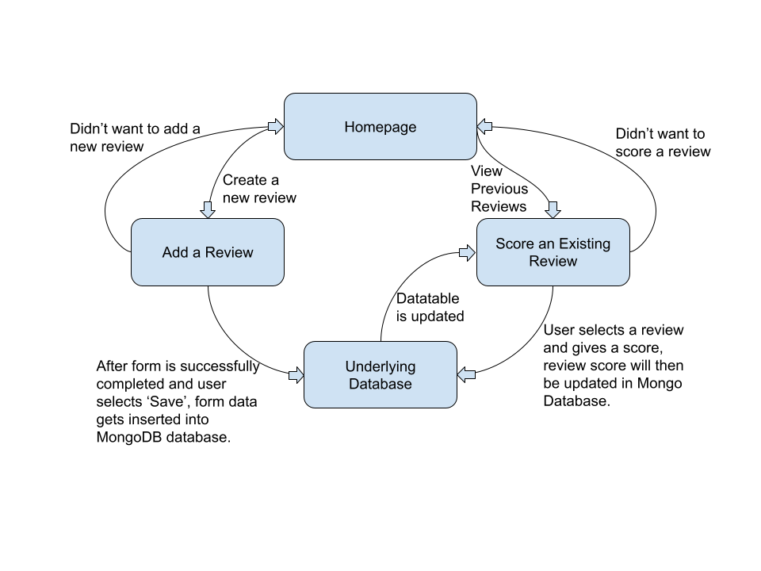

# ArticleRevSys
Assignment for a fourth year CS Course (CSci 483 - Interactive Programming in Java)


## Project Requirements
- [JDK 11](https://java.com/en/)
- [NetBeans IDE](https://netbeans.apache.org/download/index.html)
- Payara Server (*Installed using NetBeans IDE*)
- [MongoDB Community Server](https://www.mongodb.com/try/download/community)

To be able to connect this JSF project to the Mongo Database, you will need the Maven MongoDB Java Driver added to the pom.xml file.
```xml
<dependencies>
    <dependency>
        <groupId>org.mongodb</groupId>
        <artifactId>mongo-java-driver</artifactId>
        <version>2.12.3</version>
    </dependency>
</dependencies>
```

To be able to share the local Mongo database to another system, you will need to run the following commands:

*To dump database to output directory*

```bash
$ mongod --dbpath ~/data/db 
$ mongodump --db DatabaseName -o ./DirectoryName
```

*After copying that directory to another machine*

```bash
$ mongod --dbpath ~/data/db
$ mongorestore --db DBName ./DirectoryName
``` 

> **Note:** If macOS prevents either of `mongod`, `mongodump`, or `mongorestore`
> follow the steps below:
> 1. Open *System Preferences*
> 2. Select the *Security and Privacy* pane.
> 3. Under the General tab, click the button to the right of the message about mongo, labelled either **Open Anyway** or **Allow Anyway** depending on your version of macOS.


## How To Run
Before the project is run, the MongoDB primary daemon process needs to be started using the command (*assuming you have set your data directory in the root folder `~`.*) 

```bash
$ mongod --dbpath ~/data/db
```

This project can be opened in NetBeans IDE and can be easily run there.


## Project Workflow



## Demo Screenshots
*To be later added as more features are implemented*
